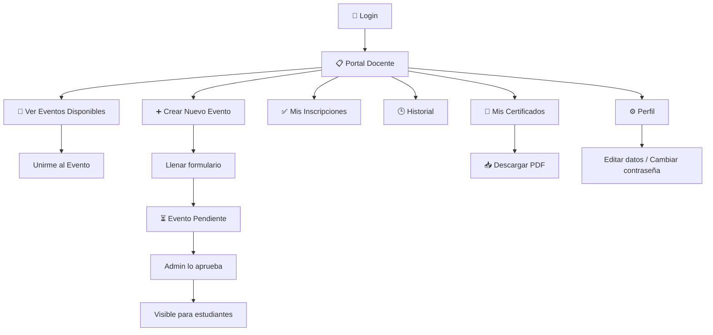

# 📘 Manual de Usuario — Rol Docente / Coordinador

## Sistema SIGUE (Sistema Integral de Gestión Universitaria de Eventos)

**Versión:** 1.0  
**Fecha:** Febrero 2026  
**Audiencia:** Docentes y Coordinadores del sistema

---

## Tabla de Contenido

1. [Inicio de Sesión](#1-inicio-de-sesión)
2. [Panel de Docente](#2-panel-de-docente)
3. [Gestión de Eventos](#3-gestión-de-eventos)
4. [Inscripción y Participación en Eventos](#4-inscripción-y-participación-en-eventos)
5. [Mis Certificados](#5-mis-certificados)
6. [Perfil de Usuario](#6-perfil-de-usuario)
7. [Cerrar Sesión](#7-cerrar-sesión)

---

## 1. Inicio de Sesión

**Ruta:** `/login`

### Descripción

La pantalla de inicio de sesión presenta un formulario centrado con el branding institucional de Univalle.

### Campos del Formulario

| Campo              | Descripción                                                   |
| ------------------ | ------------------------------------------------------------- |
| **Identificación** | Número de identificación del docente                          |
| **Contraseña**     | Contraseña del usuario. Incluye botón 👁️ para mostrar/ocultar |

### Pasos para Ingresar

1. Visitar `http://localhost:5173/login`
2. Ingresar la **Identificación** y la **Contraseña**
3. Hacer clic en **"Ingresar"**
4. El sistema redirige automáticamente al **Portal Docente**

### ¿No tiene cuenta?

Debajo del formulario existe el enlace **"¿No tienes cuenta? Crear Cuenta"** que abre un modal de registro. Al registrarse como **Docente**:

- Seleccionar el rol **"Docente"**
- Completar: Nombre Completo, Identificación, Correo, Programa/Dependencia, Contraseña
- Se envía un código de verificación de 4 dígitos al correo

---

## 2. Panel de Docente

**Ruta:** `/teacher-dashboard`

### Descripción

Al ingresar, el docente ve el **Portal Docente** con un encabezado de bienvenida y la lista completa de eventos del sistema.

### Barra de Navegación Superior

| Elemento             | Descripción                 |
| -------------------- | --------------------------- |
| **Logo Univalle**    | Enlace al inicio del portal |
| **"Hola, [Nombre]"** | Nombre del docente          |
| **⚙️**               | Acceso al Perfil de Usuario |
| **"Salir"**          | Cerrar sesión               |

### Contenido Principal

El portal muestra directamente el módulo de **Eventos y Actividades** con:

- Mensaje de bienvenida: _"Puedes crear eventos (sujetos a aprobación)."_
- Botón **"➕ Crear Nuevo Evento"** (visible solo para docentes/coordinadores)
- **Pestañas de navegación** para filtrar eventos

---

## 3. Gestión de Eventos

### 3.1 Pestañas de Navegación

El docente cuenta con **4 pestañas** para navegar entre diferentes vistas de eventos:

| Pestaña               | Icono | Descripción                                          |
| --------------------- | ----- | ---------------------------------------------------- |
| **Disponibles**       | 📅    | Eventos próximos en los que aún no se ha inscrito    |
| **Mis Inscripciones** | ✅    | Eventos a los que el docente se ha inscrito          |
| **Historial**         | 🕒    | Eventos pasados (ya finalizados)                     |
| **Mis Certificados**  | 📜    | Certificados de asistencia generados para el docente |

---

### 3.2 Crear un Evento

> [!IMPORTANT]
> Los eventos creados por docentes quedan en estado **"PENDIENTE"** hasta que un Administrador los apruebe. Solo después serán visibles para los estudiantes.

#### Pasos

1. Hacer clic en **"➕ Crear Nuevo Evento"**
2. Se abre un modal con formulario dividido en secciones:

#### Sección: 📋 Información del Evento

| Campo             | Tipo     | Requerido | Descripción                                          |
| ----------------- | -------- | --------- | ---------------------------------------------------- |
| Título del Evento | Texto    | ✅        | Nombre del evento (ej: "Seminario de Investigación") |
| Descripción       | Textarea | ❌        | Detalles del evento                                  |
| Fecha Inicio      | Datetime | ✅        | Fecha y hora de inicio                               |
| Fecha Fin         | Datetime | ❌        | Fecha y hora de finalización                         |

#### Sección: 📍 Ubicación y Difusión

| Campo            | Tipo     | Requerido | Descripción                                  |
| ---------------- | -------- | --------- | -------------------------------------------- |
| Lugar del Evento | Selector | ✅        | Ubicaciones registradas por el administrador |
| Flyer / Imagen   | Archivo  | ❌        | Imagen promocional del evento (PNG/JPG)      |

#### Sección: ¿A quién va dirigido?

- Lista de **checkboxes** con los **programas académicos** disponibles
- Indica cuántos programas han sido seleccionados
- **Opción de Difusión:** Al crear, se puede activar **"📧 Enviar correos de difusión al crear"** para notificar automáticamente a los estudiantes de los programas seleccionados

#### Sección: Opciones Adicionales

| Opción                               | Descripción                                                                                                                |
| ------------------------------------ | -------------------------------------------------------------------------------------------------------------------------- |
| **Requiere Entregables / Souvenirs** | Activa la gestión de entregables con opciones rápidas: Desayuno, Almuerzo, Cena, Refrigerio, Souvenir, Certificado Impreso |
| **Controlar Asistencia (QR)**        | Habilita el sistema de control de asistencia mediante códigos QR                                                           |

3. Hacer clic en **"✨ Crear Evento"**
4. El evento queda en estado **⏳ Pendiente** hasta ser aprobado

> [!NOTE]
> Si se activa la difusión y el administrador aprueba el evento, los correos se habrán enviado previamente desde la creación.

---

### 3.3 Editar un Evento

Solo puedes editar eventos **que tú hayas creado**:

1. En la tarjeta del evento, hacer clic en **"✏️ Editar"**
2. Se abre el modal con los datos pre-cargados
3. Modificar los campos necesarios
4. Hacer clic en **"💾 Guardar Cambios"**

---

### 3.4 Eliminar un Evento

Solo puedes eliminar eventos **que tú hayas creado**:

1. En la tarjeta del evento, hacer clic en **"🗑️ Eliminar"**
2. Confirmar la acción en el diálogo: _"¿Seguro que deseas eliminar este evento?"_

> [!WARNING]
> Esta acción no se puede deshacer.

---

### 3.5 Tarjetas de Eventos

Cada evento se muestra como una tarjeta (card) con:

| Elemento         | Descripción                                      |
| ---------------- | ------------------------------------------------ |
| Imagen del flyer | Si el evento tiene imagen promocional            |
| Título           | Nombre del evento                                |
| 📅 Fecha y hora  | Cuándo se realiza                                |
| 📍 Ubicación     | Dónde se realiza                                 |
| Descripción      | Detalles del evento                              |
| Badges           | ⏳ Pendiente, 🎁 Entregable, 📱 QR               |
| Botones          | ✏️ Editar, 🗑️ Eliminar (solo en eventos propios) |

---

## 4. Inscripción y Participación en Eventos

### Inscribirse a un Evento

1. Ir a la pestaña **"📅 Disponibles"**
2. Encontrar el evento deseado
3. Hacer clic en **"Unirme al Evento"**
4. Se muestra: _"Te has inscrito al evento exitosamente"_

### Ver Mis Inscripciones

1. Ir a la pestaña **"✅ Mis Inscripciones"**
2. Se muestran los eventos próximos a los que estás inscrito
3. Cada evento muestra: **"✅ Ya estás inscrito"**

### Ver Historial

1. Ir a la pestaña **"🕒 Historial"**
2. Se muestran los eventos ya finalizados
3. Cada evento muestra: **"🏁 Finalizado"**

---

## 5. Mis Certificados

### Descripción

La pestaña **"📜 Mis Certificados"** muestra todos los certificados de asistencia generados para el docente.

### Vista

| Elemento     | Descripción                                             |
| ------------ | ------------------------------------------------------- |
| **Título**   | "📜 Mis Certificados"                                   |
| **Contador** | "Tienes X certificado(s) disponible(s)"                 |
| **Tabla**    | Lista con columnas: Evento, Fecha de Generación, Acción |

### Descargar un Certificado

1. Ir a la pestaña **"📜 Mis Certificados"**
2. Localizar el certificado deseado en la tabla
3. Hacer clic en **"📥 Descargar PDF"**
4. El archivo PDF se descarga automáticamente

### Sin Certificados

Si no tienes certificados generados, se muestra:

- 🎓 _"Aún no tienes certificados generados."_
- _"Cuando asistas a un evento y se generen certificados, aparecerán aquí."_

---

## 6. Perfil de Usuario

**Ruta:** `/profile`

### Descripción

Permite al docente ver y editar su información personal y cambiar su contraseña. Se accede haciendo clic en el botón **⚙️** de la barra de navegación.

### Datos Básicos

| Campo                  | Editable | Descripción                      |
| ---------------------- | -------- | -------------------------------- |
| Identificación         | ❌       | Mostrado en gris, no modificable |
| Rol                    | ❌       | Muestra "Docente" en gris        |
| Nombre Completo        | ✅       | Nombre del usuario               |
| Email                  | ✅       | Correo electrónico               |
| Dependencia / Programa | ✅       | Departamento o programa          |

### Cambiar Contraseña

| Campo                      | Descripción                                       |
| -------------------------- | ------------------------------------------------- |
| Contraseña Actual          | Requerida para autorizar el cambio                |
| Nueva Contraseña           | Mínimo 6 caracteres                               |
| Confirmar Nueva Contraseña | Se habilita solo al escribir una nueva contraseña |

Al guardar: _"Tus datos se han guardado correctamente."_

> [!TIP]
> Si solo deseas actualizar tu nombre o email, no es necesario llenar los campos de contraseña.

---

## 7. Cerrar Sesión

Hacer clic en el botón **"Salir"** en la esquina superior derecha. El sistema redirige a la pantalla de login.

---

## Flujo Principal del Docente

---

## Diferencias con el Rol Administrador

| Característica              | Docente                   | Administrador             |
| --------------------------- | ------------------------- | ------------------------- |
| Crear eventos               | ✅ (pendiente aprobación) | ✅ (aprobación inmediata) |
| Aprobar eventos             | ❌                        | ✅                        |
| Editar cualquier evento     | ❌ (solo propios)         | ✅                        |
| Eliminar cualquier evento   | ❌ (solo propios)         | ✅                        |
| Dashboard de evento (KPIs)  | ❌                        | ✅                        |
| Gestión de usuarios         | ❌                        | ✅                        |
| Carga masiva de estudiantes | ❌                        | ✅                        |
| Opciones del sistema        | ❌                        | ✅                        |
| Certificados (admin)        | ❌                        | ✅                        |
| Inscribirse a eventos       | ✅                        | ❌                        |
| Ver certificados propios    | ✅                        | ❌                        |

---

> **SIGUE** — Sistema Integral de Gestión Universitaria de Eventos  
> Universidad del Valle — Sede Palmira  
> Manual generado en Febrero 2026
