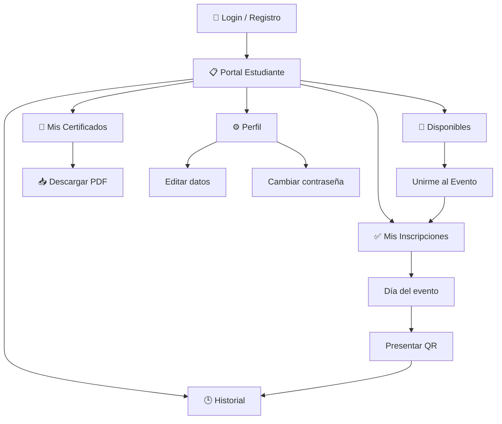

# 📘 Manual de Usuario — Rol Estudiante

## Sistema SIGUE (Sistema Integral de Gestión Universitaria de Eventos)

**Versión:** 1.0  
**Fecha:** Febrero 2026  
**Audiencia:** Estudiantes universitarios

---

## Tabla de Contenido

1. [Inicio de Sesión](#1-inicio-de-sesión)
2. [Registro de Cuenta](#2-registro-de-cuenta)
3. [Portal del Estudiante](#3-portal-del-estudiante)
4. [Eventos Disponibles](#4-eventos-disponibles)
5. [Mis Inscripciones](#5-mis-inscripciones)
6. [Historial de Eventos](#6-historial-de-eventos)
7. [Mis Certificados](#7-mis-certificados)
8. [Perfil de Usuario](#8-perfil-de-usuario)
9. [Cerrar Sesión](#9-cerrar-sesión)

---

## 1. Inicio de Sesión

**Ruta:** `/login`

### Descripción

La pantalla de login presenta un formulario centrado con el branding institucional de Univalle y un cubo 3D animado decorativo.

### Campos del Formulario

| Campo              | Descripción                                          |
| ------------------ | ---------------------------------------------------- |
| **Identificación** | Tu número de cédula o código estudiantil             |
| **Contraseña**     | Tu contraseña. Incluye botón 👁️ para mostrar/ocultar |

### Pasos para Ingresar

1. Visitar `http://localhost:5173/login`
2. Ingresar tu **Identificación** y **Contraseña**
3. Hacer clic en **"Ingresar"**
4. El sistema te redirige al **Portal Estudiante**

> [!TIP]
> Si olvidas tu contraseña, contacta al administrador del sistema para que la restablezca desde la Gestión de Usuarios.

---

## 2. Registro de Cuenta

Si no tienes cuenta en el sistema, puedes crear una desde la pantalla de login.

### Pasos

1. Hacer clic en **"¿No tienes cuenta? Crear Cuenta"**
2. Se abre un modal de registro con los siguientes campos:

| Campo                | Tipo     | Requerido | Descripción                                                                                                     |
| -------------------- | -------- | --------- | --------------------------------------------------------------------------------------------------------------- |
| Rol                  | Selector | ✅        | Seleccionar **"Estudiante"**                                                                                    |
| Nombre Completo      | Texto    | ✅        | Tu nombre y apellidos                                                                                           |
| Identificación       | Texto    | ✅        | Cédula o código estudiantil                                                                                     |
| Correo Electrónico   | Email    | ✅        | Tu correo institucional. Se valida en tiempo real con indicador ✅ / ❌                                         |
| Programa Académico   | Texto    | ✅        | Tu programa (ej: "Ingeniería de Sistemas")                                                                      |
| Contraseña           | Password | ✅        | Incluye indicador de fortaleza (Débil / Media / Fuerte) y botón "🪄 Sugerir" para generar una contraseña segura |
| Confirmar Contraseña | Password | ✅        | Debe coincidir con la contraseña                                                                                |

3. Hacer clic en **"Crear Cuenta"**
4. Se envía un **código de verificación de 4 dígitos** a tu correo electrónico
5. Ingresa el código en la pantalla de verificación
6. ¡Listo! Tu cuenta ha sido creada y puedes iniciar sesión

> [!IMPORTANT]
> Debes verificar tu correo electrónico antes de poder iniciar sesión. Revisa también la carpeta de spam.

---

## 3. Portal del Estudiante

**Ruta:** `/student-dashboard`

### Descripción

Al ingresar, ves el **Panel de Estudiante** con un mensaje de bienvenida y la lista de eventos organizados en pestañas.

### Barra de Navegación Superior

| Elemento                | Descripción                 |
| ----------------------- | --------------------------- |
| **Logo Univalle**       | Enlace al inicio del portal |
| **"Hola, [Tu Nombre]"** | Tu nombre                   |
| **⚙️**                  | Acceso a tu Perfil          |
| **"Salir"**             | Cerrar sesión               |

### Mensaje de Bienvenida

_"Bienvenido Estudiante. Aquí podrás ver, inscribirte y consultar el historial de eventos."_

### Pestañas de Navegación

El portal tiene **4 pestañas** principales:

| Pestaña               | Icono | Descripción                                   |
| --------------------- | ----- | --------------------------------------------- |
| **Disponibles**       | 📅    | Eventos próximos a los que puedes inscribirte |
| **Mis Inscripciones** | ✅    | Eventos a los que ya te inscribiste           |
| **Historial**         | 🕒    | Eventos pasados                               |
| **Mis Certificados**  | 📜    | Tus certificados de asistencia                |

---

## 4. Eventos Disponibles

### Descripción

La pestaña **"📅 Disponibles"** muestra los eventos próximos a los que **aún no te has inscrito**. Solo aparecen eventos aprobados por el administrador.

### Tarjetas de Eventos

Cada evento se muestra como una tarjeta con:

| Elemento         | Descripción                                                                 |
| ---------------- | --------------------------------------------------------------------------- |
| **Imagen**       | Flyer promocional del evento (si tiene)                                     |
| **Título**       | Nombre del evento                                                           |
| **📅 Fecha**     | Fecha y hora del evento                                                     |
| **📍 Ubicación** | Lugar donde se realiza                                                      |
| **Descripción**  | Detalles del evento                                                         |
| **Badges**       | 🎁 Entregable (si incluye souvenirs), 📱 QR (si controla asistencia con QR) |
| **Botón**        | **"Unirme al Evento"**                                                      |

### Inscribirse a un Evento

1. Ir a la pestaña **"📅 Disponibles"**
2. Revisar los eventos disponibles
3. Hacer clic en **"Unirme al Evento"** en el evento deseado
4. Se muestra: _"Te has inscrito al evento exitosamente"_
5. El evento se mueve a la pestaña **"✅ Mis Inscripciones"**

### Sin Eventos Disponibles

Si no hay eventos próximos, se muestra:

- _"No hay eventos próximos disponibles para inscripción."_

---

## 5. Mis Inscripciones

### Descripción

La pestaña **"✅ Mis Inscripciones"** muestra los eventos **próximos** a los que ya te inscribiste.

### Información Mostrada

Cada evento inscrito muestra los mismos datos que la vista de disponibles, pero en lugar del botón "Unirme", se muestra:

- **"✅ Ya estás inscrito"** (badge verde)

### Sin Inscripciones

Si no te has inscrito a ningún evento próximo:

- _"No te has inscrito a ningún evento próximo."_

> [!TIP]
> Si un evento al que estás inscrito tiene control de asistencia por QR, recibirás un correo con tu código QR. Preséntalo el día del evento.

---

## 6. Historial de Eventos

### Descripción

La pestaña **"🕒 Historial"** muestra los eventos **ya finalizados** (cuya fecha fin ha pasado).

### Información Mostrada

Cada evento pasado muestra los mismos datos, con el indicador:

- **"🏁 Finalizado"** (badge gris)

### Sin Historial

Si no tienes eventos pasados:

- _"No tienes eventos pasados registrados."_

---

## 7. Mis Certificados

### Descripción

La pestaña **"📜 Mis Certificados"** muestra todos los certificados de asistencia que han sido generados para ti.

### Vista con Certificados

| Elemento     | Descripción                                 |
| ------------ | ------------------------------------------- |
| **Título**   | "📜 Mis Certificados"                       |
| **Contador** | "Tienes **X** certificado(s) disponible(s)" |

#### Tabla de Certificados

| Columna                 | Descripción                                                  |
| ----------------------- | ------------------------------------------------------------ |
| **Evento**              | Nombre del evento para el que se generó el certificado       |
| **Fecha de Generación** | Cuándo se generó el certificado (formato: día de mes de año) |
| **Acción**              | Botón **"📥 Descargar PDF"**                                 |

### Descargar un Certificado

1. Ir a la pestaña **"📜 Mis Certificados"**
2. Encontrar el certificado en la tabla
3. Hacer clic en **"📥 Descargar PDF"**
4. Mientras se descarga, el botón muestra: **"⏳ Descargando..."**
5. El archivo PDF se guarda automáticamente en tu carpeta de descargas

### Sin Certificados

Si aún no tienes certificados:

- 🎓 _"Aún no tienes certificados generados."_
- _"Cuando asistas a un evento y se generen certificados, aparecerán aquí."_

> [!NOTE]
> Los certificados se generan por el administrador después de que asistas al evento. Si asististe y no ves tu certificado, contacta al organizador del evento.

---

## 8. Perfil de Usuario

**Ruta:** `/profile`

### Descripción

Permite ver y editar tu información personal y cambiar tu contraseña. Se accede haciendo clic en **⚙️** en la barra superior.

### Datos Básicos

| Campo                  | Editable | Descripción                      |
| ---------------------- | -------- | -------------------------------- |
| Identificación         | ❌       | Mostrado en gris, no modificable |
| Rol                    | ❌       | Muestra "Estudiante" en gris     |
| Nombre Completo        | ✅       | Tu nombre completo               |
| Email                  | ✅       | Tu correo electrónico            |
| Dependencia / Programa | ✅       | Tu programa académico            |

### Cambiar Contraseña

| Campo                      | Descripción                                       |
| -------------------------- | ------------------------------------------------- |
| Contraseña Actual          | Requerida para autorizar el cambio                |
| Nueva Contraseña           | Mínimo 6 caracteres                               |
| Confirmar Nueva Contraseña | Se habilita solo al escribir una nueva contraseña |

### Guardar Cambios

1. Modificar los campos deseados
2. Hacer clic en **"Guardar Cambios"**
3. Se muestra: _"Tus datos se han guardado correctamente."_

> [!TIP]
> Si solo deseas actualizar tu nombre o email, no es necesario llenar los campos de contraseña.

---

## 9. Cerrar Sesión

Hacer clic en el botón **"Salir"** en la esquina superior derecha de la barra de navegación. El sistema te redirige a la pantalla de login.

---

## Flujo Principal del Estudiante

---

## Preguntas Frecuentes

### ¿Cómo recibo mi código QR?

Si el evento tiene control de asistencia por QR, recibirás un correo electrónico con tu código QR después de inscribirte.

### ¿Puedo cancelar mi inscripción?

El sistema actualmente no permite cancelar la inscripción directamente. Contacta al administrador si necesitas hacerlo.

### ¿Cuándo aparece mi certificado?

El administrador genera los certificados después de finalizar el evento. Pueden tardar unos días dependiendo del organizador.

### ¿Puedo inscribirme a varios eventos?

Sí, puedes inscribirte a todos los eventos disponibles que desees.

### ¿Qué significan los badges en los eventos?

- 🎁 **Entregable** = El evento incluye souvenirs, refrigerios u otros entregables
- 📱 **QR** = El evento controla la asistencia mediante códigos QR

---

> **SIGUE** — Sistema Integral de Gestión Universitaria de Eventos  
> Universidad del Valle — Sede Palmira  
> Manual generado en Febrero 2026
